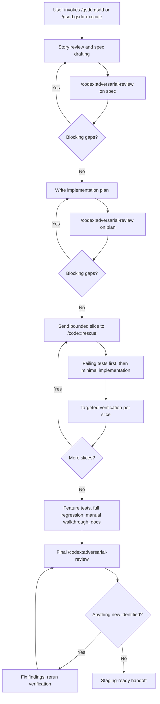

# Gold Standard Driven Development

Gold Standard Driven Development, or GSDD, is a Claude Code plugin and marketplace repo for turning rough feature requests into reviewed specs, reviewed plans, failing tests, working code, and staging-ready branches.

The workflow is intentionally opinionated:
- story first
- spec before code
- plan before implementation
- tests before production changes
- adversarial review before completion
- staging-ready before "done"

This project is heavily inspired by [obra/superpowers](https://github.com/obra/superpowers), especially its skill-first workflow, hard gates, and emphasis on evidence over claims.

## How It Works

Like `superpowers`, GSDD is meant to operate as a skill-first system:

1. `gsdd-story-review` turns a rough idea into an approved spec.
2. `gsdd-writing-plans` explores the codebase and writes an approved implementation plan.
3. `gsdd-execute` runs the execution phase with failing tests first, minimal implementation, targeted verification, full regression, documentation updates, and a staging-ready handoff.

`gsdd` and `gsdd-execute` are one-shot entrypoints. If the work will touch code, they should keep moving through missing prerequisites and then continue through execution until the adversarial review loop passes and the work reaches staging-ready handoff, unless the user explicitly asks to pause.

Commands stay intentionally thin. The real behavior lives in the skills, so workflow changes should generally be made in `plugins/gsdd/skills/*/SKILL.md`, not in the command wrappers.

The completion gate is also explicit: before Claude confirms the work is finished, the workflow must run a final adversarial review using `/codex:adversarial-review` so Codex can try to break the implementation, docs, and release-readiness claim before handoff.

## Example Story

Example request:

> "When a support agent refunds an order, require a short reason, show the reason in the order timeline, and send the customer a refund confirmation email. Reuse the existing refund flow if possible."

In a one-shot `gsdd` or `gsdd-execute` run, Claude should:

1. Turn that request into a spec with actors, permissions, state transitions, failure paths, audit requirements, and acceptance criteria.
2. Run `/codex:adversarial-review` on the spec and revise it until Codex finds no blocking gaps.
3. Explore the codebase and write an implementation plan that reuses the existing refund flow, timeline rendering, and email infrastructure where possible.
4. Run `/codex:adversarial-review` on the plan and revise it until Codex finds no blocking gaps.
5. Send bounded slices of the implementation to `/codex:rescue` for failing tests and minimal code.
6. Run targeted verification after each slice, then feature tests, full regression, and a manual workflow walkthrough.
7. Run a final `/codex:adversarial-review` on the implementation, documentation, and release-readiness claim.
8. If Codex finds anything new, fix it, rerun verification, and trigger a fresh `/codex:adversarial-review` again.
9. Stop only when the latest adversarial review reports no blocking gaps and the work is ready for staging review.

## Example Flow



## Repo Layout

- `.claude-plugin/marketplace.json`
  Marketplace manifest for Claude Code.
- `plugins/gsdd`
  The installable plugin.
- `plugins/gsdd/commands`
  Command entrypoints for the GSDD workflow.
- `plugins/gsdd/skills`
  Reusable behavior-shaping skills for story review, planning, and execution.

## What The Plugin Does

The `gsdd` plugin helps Claude:
- turn rough stories into approved specs
- explore the codebase before planning
- write implementation plans with explicit reuse decisions
- enforce test-first execution
- invoke `/codex:adversarial-review` for adversarial review of specs, plans, and the final pre-handoff implementation check
- invoke `/codex:rescue` to write bounded implementation slices
- explicitly record what Codex reviewed and what changed because of that review
- stop at "ready for staging review" unless deployment has happened

## Local Validation

Validate the marketplace:

```bash
claude plugin validate .
```

Validate the plugin itself:

```bash
claude plugin validate ./plugins/gsdd
```

Test the plugin without installing it:

```bash
claude --plugin-dir ./plugins/gsdd
```

## Marketplace Install

After pushing this repo to GitHub, add the marketplace:

```bash
claude plugin marketplace add YOUR_GITHUB_USERNAME/gold-standard-driven-development
```

Then install the plugin:

```bash
claude plugin install gsdd@gsdd-marketplace
```

Or from inside an interactive Claude Code session:

```text
/plugin marketplace add YOUR_GITHUB_USERNAME/gold-standard-driven-development
/plugin install gsdd@gsdd-marketplace
```
